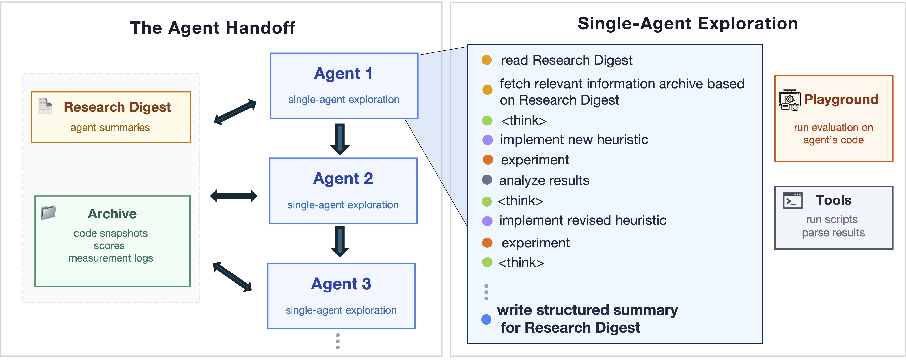

<h1 align="center">Engram</h1>

<p align="center">
  <strong>AI-Driven Algorithm Design for Computer Systems</strong>
</p>

<p align="center">
  <a href="https://arxiv.org/abs/2603.21321"></a>
  <a href="https://www.caisconf.org/program/2026/papers/improving-coherence-and-persistence-in-agentic-ai-for-system-optimization/"></a>
  <a href="https://www.python.org/downloads/release/python-3110/"></a>
  <a href="LICENSE"></a>
</p>

<p align="center">
  <em>To appear at <a href="https://www.caisconf.org/program/2026/papers/improving-coherence-and-persistence-in-agentic-ai-for-system-optimization/">ACM CAIS 2026</a>.</em>
</p>

<p align="center">
  
</p>

---

Engram is an agentic researcher architecture that **autonomously designs algorithms** for computer systems. Given a problem description and a simulation environment, Engram's agents iteratively write code, run experiments, analyze results, and refine their approach -- producing **interpretable, human-expert-level algorithms**.

Engram addresses two critical failure modes of prior approaches:

- :arrows_counterclockwise: **Evolutionary Neighborhood Bias** -- Code-evolution systems propose variants and select them using scalar benchmark scores. This works for incremental refinements, but fails when improvements require coordinated multi-step changes: reformulating the problem, adding tractable relaxations, or accepting temporary regressions to reach a different algorithmic family.

- :hourglass_flowing_sand: **Coherence Ceiling** -- A single long-running agent context eventually suffers from degradation and "context rot," where attention becomes uneven. Meanwhile, independent parallel runs don't accumulate knowledge -- each must rediscover the same modeling insights from scratch.

Engram overcomes both by organizing exploration into a sequence of agents that accumulate knowledge through a persistent **Archive** and **Research Digest**.

---

## How It Works

Engram runs a sequence of agents on a systems problem. Each agent:

1. **Reads** the task description, prior Research Digest, and initial/best code
2. **Implements** candidate algorithms
3. **Experiments** by running simulations and collecting results
4. **Analyzes** outcomes and iterates on the approach

When an agent exhausts its context or reaches a timeout, its workspace (code snapshots, experiment logs, results) is archived. A **Research Digest** -- a compact summary of high-level modeling insights -- is distilled and passed to the next agent. The next agent begins with a fresh context window, reading the Digest to build on prior discoveries rather than starting from scratch.

Engram is implemented using the [DeepAgents](https://github.com/langchain-ai/deepagents) library in LangChain. Each agent has access to DeepAgents tools (filesystem read/write, shell), plus a `run_simulation` tool that evaluates candidate algorithms against the problem's simulation environment.

---

## Quick Start

### Prerequisites

- Python 3.11+
- Docker (required -- agents execute code in Docker containers)
- An OpenAI API key

### Installation

```bash
git clone --recurse-submodules https://github.com/mit-nms/Glia.git
cd Glia
# If you cloned without --recurse-submodules, run:
#   git submodule update --init --recursive

# Create environment
python3.11 -m venv .venv
source .venv/bin/activate
pip install -r requirements.txt
pip install -r SystemBench/vidur/requirement.txt

# OpenEvolve baseline (only needed to run openevolve_example_usage.py)
pip install -e Architect/openevolve/

# Set your API key
export OPENAI_API_KEY="your-key-here"

# Verify Docker is running (agents execute their shell commands inside a container)
docker ps
```

<details>
<summary><strong>Docker installation</strong> (click to expand)</summary>

```bash
curl -fsSL https://get.docker.com -o get-docker.sh
sudo sh get-docker.sh
sudo systemctl start docker && sudo systemctl enable docker
sudo usermod -aG docker $USER
# Log out and back in, then verify:
docker ps
```
</details>

### Run Your First Experiment

Start with a quick smoke test to verify your install:

```bash
bash scripts/smoke_test.sh
```

If that succeeds, try a small end-to-end run on the Multi-Cloud Multicast problem:

```bash
python examples/handoff_example_usage.py \
    --problem_name cloudcast \
    --model o3 \
    --num_runs 1 \
    --max_agents 5 \
    --agent_timeout 30
```

Each run produces JSON logs with generated code, scores, and full reasoning traces
under `results/`. See `python examples/handoff_example_usage.py --help` for all
flags — notably `--num_runs`, `--max_agents`, and `--agent_timeout` control how
long a run takes.

---

## Benchmark Problems

Engram is evaluated on three core problems in the [paper](https://arxiv.org/abs/2603.21321):

| | Problem | Domain | Task |
|:--|:--------|:-------|:-----|
| :cloud: | **Multi-Cloud Multicast** | Networking | Design a data transfer routing algorithm that optimizes cost and transfer time across cloud providers. |
| :robot: | **LLM Request Routing** | ML Systems | Design a global request scheduler for distributing LLM inference requests across GPU replicas. |
| :mag: | **KV Cache Reuse** | Databases | Optimize KV cache reuse strategy for databases with natural language SQL queries. |

```bash
python examples/handoff_example_usage.py --problem_name cloudcast    # Multi-Cloud Multicast
python examples/handoff_example_usage.py --problem_name vidur        # LLM Request Routing
python examples/handoff_example_usage.py --problem_name llm_sql      # KV Cache Reuse
```

Beyond the core problems, the repository supports additional benchmarks:

- **ADRS** -- scheduling, load balancing, telemetry repair, and more. See the [ADRS README](SystemBench/ADRS/README.md) and the [upstream ADRS project](https://github.com/UCB-ADRS/ADRS).
- **FrontierCS** -- 100+ problem instances across systems, ML, security, and scientific computing. See the [FrontierCS README](SystemBench/FrontierCS/README.md) and the [FrontierCS project](https://github.com/FrontierCS/Frontier-CS).

See the [SystemBench README](SystemBench/README.md) for the full list of available problems.

---

## Other Methods

This repository includes baseline and alternative optimization methods for comparison with Engram:

- **Agentic methods** -- single-agent, tree search, curator+subagents
- **Evolutionary methods** -- FunSearch, Evolution of Heuristics, OpenEvolve
- **Non-iterative baselines** -- one-shot

See the [examples README](examples/README.md) for how to run each one.

---

## Adding Your Own Problem

To apply Engram to a new systems problem, you need:

1. **An evaluator** that scores candidate algorithms by running simulations
2. **A task prompt** that describes the problem to the agent

### Step 1: Create an Evaluator

Write an evaluator class inheriting from [`SystemBench/evaluator.py`](SystemBench/evaluator.py). See the [SystemBench README](SystemBench/README.md) for the full interface specification and working examples.

### Step 2: Write a Task Prompt

Create a task prompt file (e.g., `SystemBench/my_problem/deepagents_files/task_prompt.txt`) describing:
- What the system does
- What the agent needs to optimize
- Input/output format of the target function
- Constraints and domain knowledge

### Step 3: Run

Add your problem to an example script (see [`examples/handoff_example_usage.py`](examples/handoff_example_usage.py) for the pattern), or use the CLI:

```bash
python -m Architect.main \
    --method agentic_handoff \
    --model o3 \
    --task_prompt_path SystemBench/my_problem/deepagents_files/task_prompt.txt \
    --evaluator_path SystemBench/my_problem \
    --results_dir results/my_problem_run1 \
    --debug
```

Run `python -m Architect.main --help` for all available options.

---

## Project Structure

```
├── Architect/          # Optimization framework and methods
├── SystemBench/        # Benchmark problems and evaluators
├── examples/           # Example scripts for running each method
├── scripts/            # Analysis and plotting utilities
└── docs/               # Paper and research notes
```

See the [Architect README](Architect/README.md), [SystemBench README](SystemBench/README.md), and [examples README](examples/README.md) for details.

---

## Experiment Viewer

A web UI for browsing results from Tree, Handoff, and OpenEvolve runs — no `aggregated_results.json` required.

```bash
pip install flask plotly  # one-time
python scripts/experiment_viewer/server.py
# open http://localhost:5005
```

In the UI, paste one or more result directories (one per line) and click **Set & Refresh**. The viewer auto-discovers runs, plots score evolution with baselines, and shows the best solution code and logs. Config is saved to `scripts/experiment_viewer/config.json`.

---

## Citation

If you use Engram in your work, please consider citing our papers:

> Pantea Karimi\*, Kimia Noorbakhsh\*, Mohammad Alizadeh, and Hari Balakrishnan. "Improving Coherence and Persistence in Agentic AI for System Optimization." arXiv preprint arXiv:2603.21321, 2026.

> Pouya Hamadanian\*, Pantea Karimi\*, Arash Nasr-Esfahany\*, Kimia Noorbakhsh\*, Joseph Chandler, Ali ParandehGheibi, Mohammad Alizadeh, and Hari Balakrishnan. "Glia: A Human-Inspired AI for Automated Systems Design and Optimization." arXiv preprint arXiv:2510.27176, 2025.

\* Equal contribution

## Contact

For questions or feedback, reach out to [Kimia Noorbakhsh](mailto:kimian@mit.edu) or [Pantea Karimi](mailto:pkarimib@mit.edu).
